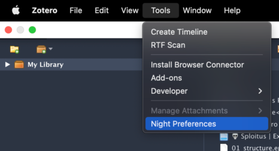
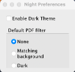

[Zotero-night](https://github.com/tefkah/zotero-night) is a must-have for Zotero. It enables a dark mode which is a life saver for anyone using Zotero at night.
 
One thing I notice is that after installing and restarting Zotero, you need to enable the dark theme, selecting `tools\night preferences`

and then select `Enable Dark Theme`

